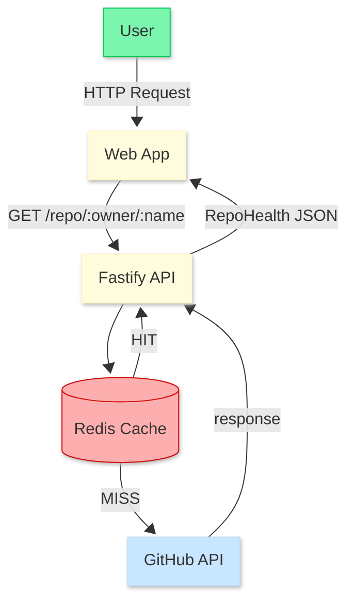

# 🚀 GitPulse — GitHub Repository Health Monitor

> A caching-first dashboard that turns raw GitHub data into a clean 
> repository health summary — powered by Redis and the GitHub REST API.

[](https://www.typescriptlang.org/)
[](https://nextjs.org/)
[](https://fastify.dev/)
[](https://redis.io/)
[](https://biomejs.dev/)
[](https://vitest.dev/)

---

## 📑 Table of Contents
- [About](#about)
- [Key Features](#key-features)
- [Tech Stack](#tech-stack)
- [Architecture](#architecture)
- [Environment Variables](#environment-variables)
- [Getting-Started](#getting-started)
- [Future Improvements](#future-improvements)

---

## About

GitPulse is a developer tool that fetches and displays a health summary 
of any public GitHub repository — stars, forks, open PRs, stale issues, 
and top contributors.

The core technical focus is the **Cache-Aside pattern with Redis**: 
repeated requests for the same repository are served instantly from cache, 
avoiding GitHub API rate limits.

---

## Key Features

- **Smart Caching:** Redis Cache-Aside pattern — repeated requests are served instantly, avoiding GitHub API rate limits.
- **Repository Summary:** Stars, forks, language, open PRs, stale issues and top contributors in a single request.
- **Modern UI:** Built with Tailwind CSS v4 and Framer Motion for smooth interactions.
- **Rate Limit Awareness:** Visual feedback when cache is hit vs. fresh fetch.

---

## Tech Stack

### Backend (API)
| Tech | Role |
|---|---|
| **Fastify** | High-performance API layer. |
| **Redis** | Server-side caching (TTL-based). |
| **Native Fetch** | Direct integration with GitHub REST API. |
| **Biome** | Fast linting and formatting. |

### Frontend (Web)
| Tech | Role |
|---|---|
| **Next.js 15** | App Router & Server Components. |
| **TanStack Query** | State management and caching. |
| **Tailwind CSS v4** | Next-gen utility-first styling. |
| **Lucide React** | Clean, consistent iconography. |

---

## Architecture

Data flow prioritizes performance through the **Cache-Aside pattern**, ensuring GitHub API calls are minimized on repeated requests.



## Environment Variables

### API (`/api/.env`)
```env
PORT=3000
GITHUB_TOKEN=your_token_here
REDIS_URL=your_redis_url
```

---

## Getting Started

### Prerequisites
- Node.js 20+
- pnpm
- Docker

### 1. Clone the repository

```bash
git clone https://github.com/tiagossdj/gitpulse.git
cd gitpulse
```

### 2. Install dependencies

```bash
pnpm install
```

### 3. Start Redis

```bash
docker compose up -d
```

### 4. Set up environment variables

```bash
cp api/.env.example api/.env
```

Edit `api/.env` and add your GitHub token:

```env
GITHUB_TOKEN=ghp_your_token_here
```

> Generate a token at **github.com → Settings → Developer settings → Personal access tokens → Fine-grained tokens**  
> Set Repository access to **Public repositories**. No extra permissions needed.  
> Without a token: 60 req/h — with token: 5000 req/h.

### 5. Start the development servers

```bash
pnpm dev
```

- API: http://localhost:3000
- Web: http://localhost:3001

## Future Improvements

- [ ] Private Repository Support: Implement OAuth2 flow to access user-authorized private data.
- [ ] Data Visualization: Integration of charts for historical health tracking.
- [ ] Webhook Integration: Real-time updates instead of polling.

---

⭐ If this tool helped you, leave a star!

