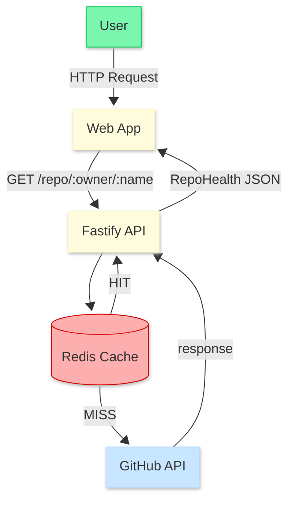

# 🚀 GitPulse — GitHub Repository Health Monitor

> A real-time monitoring dashboard that analyzes repository health, contributor activity, and issue velocity for public repositories.

[](https://www.typescriptlang.org/)
[](https://nextjs.org/)
[](https://fastify.dev/)
[](https://redis.io/)
[](https://biomejs.dev/)

---

## 📑 Table of Contents
- [About](#about)
- [Key Features](#key-features)
- [Tech Stack](#tech-stack)
- [Architecture](#architecture)
- [Environment Variables](#environment-variables)
- [Future Improvements](#future-improvements)

---

## About

**GitPulse** is a diagnostic tool for developers. It transforms raw GitHub data into actionable insights, calculating "Health Scores" based on PR turnover and issue resolution time. 

Currently, the tool is optimized for **Public Repositories**, providing a "Pulse Check" on community engagement and project maintenance.

---

## Key Features

- **Health Score Algorithm:** Logic based on open vs. closed issues/PRs ratio.
- **Activity Monitoring:** Tracks the latest contributions and issue velocity.
- **Smart Caching:** Utilizes Redis to optimize GitHub API rate limits.
- **Modern UI:** Built with Tailwind CSS v4 and Framer Motion for smooth interactions.

---

## Tech Stack

### Backend (API)
| Tech | Role |
|---|---|
| **Fastify** | High-performance API layer. |
| **Redis** | Server-side caching (TTL-based). |
| **Native Fetch** | Direct integration with GitHub REST API. |
| **Biome** | Fast linting and formatting. |

### Frontend (Web)
| Tech | Role |
|---|---|
| **Next.js 15** | App Router & Server Components. |
| **TanStack Query** | State management and caching. |
| **Tailwind CSS v4** | Next-gen utility-first styling. |
| **Lucide React** | Clean, consistent iconography. |

---

## Architecture

O fluxo de dados prioriza a performance através do padrão **Cache-Aside**, garantindo que as chamadas à API do GitHub sejam otimizadas.



## Environment Variables

### API (`/api/.env`)
```env
PORT=3000
GITHUB_ACCESS_TOKEN=your_token_here
REDIS_URL=your_redis_url
```

---

## Future Improvements

- [ ] Private Repository Support: Implement OAuth2 flow to access user-authorized private data.
- [ ] Data Visualization: Integration of charts for historical health tracking.
- [ ] Webhook Integration: Real-time updates instead of polling.

---

⭐ If this tool helped you, leave a star!

